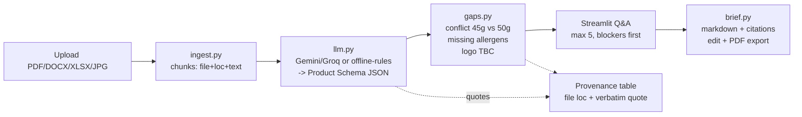

# Architecture — BriefForge AI

```mermaid
flowchart LR
    U[Upload PDF/DOCX/XLSX/JPG] --> I[ingest.py\nchunks: file+loc+text]
    I --> E[llm.py\nGemini/Groq or offline-rules\n-> Product Schema JSON]
    E --> G[gaps.py\nconflict 45g vs 50g\nmissing allergens\nlogo TBC]
    G --> Q[Streamlit Q&A\nmax 5, blockers first]
    Q --> B[brief.py\nmarkdown + citations\nedit + PDF export]
    E -.quotes.-> P[Provenance table\nfile loc + verbatim quote]
    G -.-> P
```
